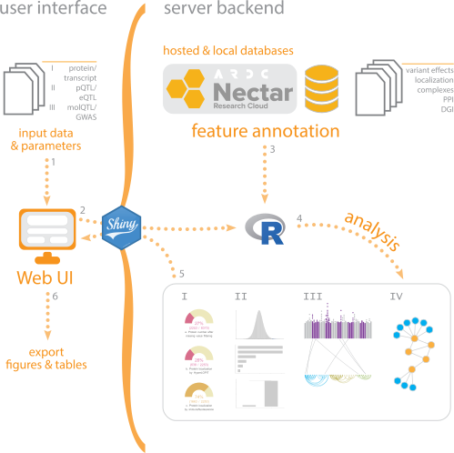
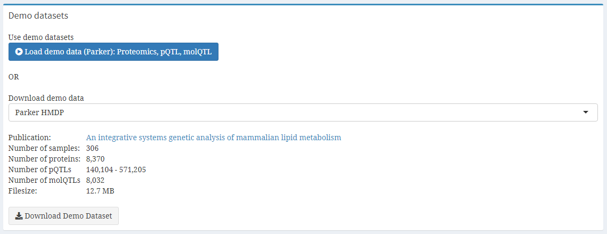
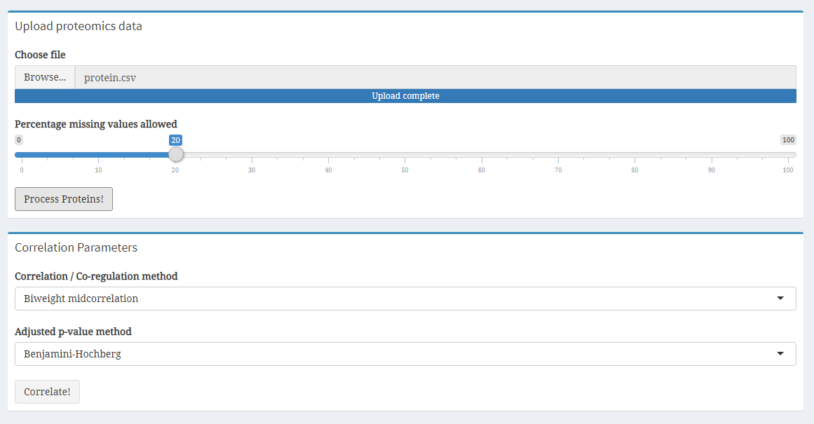
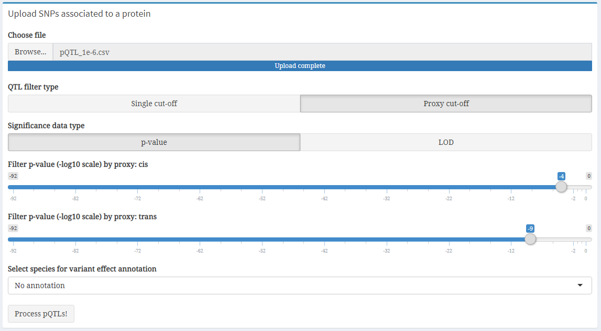
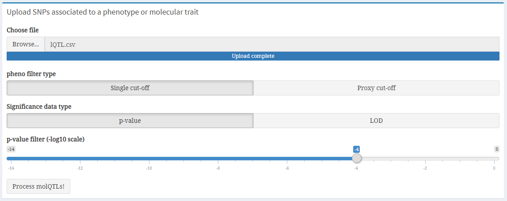
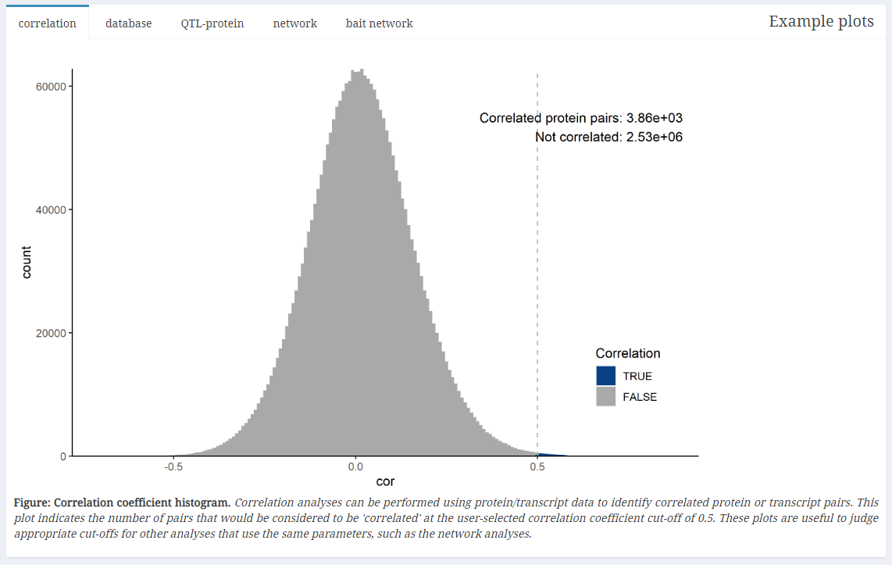
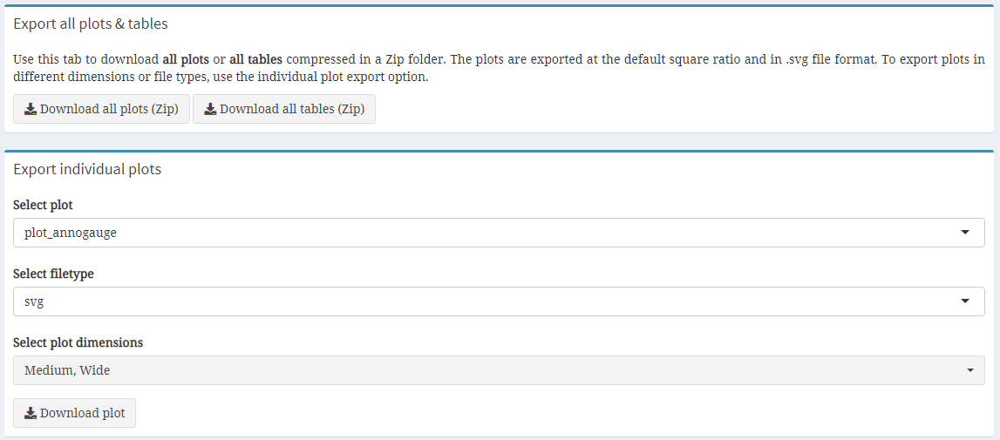

# <b>CoffeeProt: An online tool for correlation and functional enrichment of proteome-wide systems genetics</b>

 

 The integration of genomics, proteomics and phenotypic traits across genetically diverse populations is a powerful approach to discover novel biological regulators. The increasing volume of complex data require new and easy-to-use tools accessible to a variety of scientists for the discovery and visualization of functionally relevant associations. To meet this requirement, we developed CoffeeProt, an open-source tool that analyzes genetic variants associated to protein networks and phenotypic traits. CoffeeProt uses proteomics data to perform correlation network analysis and annotates protein-protein interactions, subcellular localizations and drug associations. It then integrates genetic and phenotypic associations along with variant effect predictions. We demonstrate its utility with the analysis of mouse and human population data enabling the rapid identification of genetic variants associated with druggable proteins and clinical traits. We expect that CoffeeProt will serve the proteomics and systems genetics communities, leading to the discovery of novel biologically relevant associations. CoffeeProt is available at www.coffeeprot.com. 

 

## <b>Table of contents</b>
* [CoffeeProt workflow](#coffeeprot-workflow)
* [Data preparation OR using demo data](#data-preparation-or-using-demo-data)
* [Data upload and processing](#data-upload-and-processing)
    * Proteomics/expression data
    * pQTL/eQTL data
    * GWAS/molQTL data
* [Analysis](#analysis)
    * Correlation analysis
    * Database enrichment
    * SNP-protein analysis
    * Network
    * Bait network
* [Data exporting](#data-exporting)
    * Tables
    * Static plots
    * Interactive plots
* [App status](#app-status)
* [Browser compatibility](#browser-compatibility)
* [Contact](#contact)
* [Citation](#citation)
* [Acknowledgements](#Acknowledgements)

 

## <b>CoffeeProt workflow</b>

 

<b>Figure. CoffeeProt workflow. </b> The CoffeeProt workflow starts with users accessing the CoffeeProt web user interface at www.CoffeeProt.com to upload datafiles and specify analysis parameters (1). The user interface and server backend running R are connected using the Shiny R package (2). Feature annotations are performed based on local databases included in CoffeeProt as well as remotely hosted databases on the Nectar Research Cloud (3). User data is analyzed to perform summary statistics (I), correlation (II), interaction (III) and network (IV) analyses (4). The results are displayed in the web interface for result interpretation by the user (5). Finally, individual tables and plots are exported (6). 

 

## <b>Data preparation OR using demo data</b>

 The easiest way to get started using CoffeeProt is by <b>using the demo dataset</b> included with the app. Simply click on the blue <code><b>Load demo data</b></code> button on the right side of the <code><b>Welcome page</b></code>. This option will directly load the proteomics, pQTL and lipidQTL data from the Parker study. To continue, navigate to the <code><b>Protein/transcript data</b></code>, <code><b>pQTL/eQTL data</b></code> and <code><b>GWAS/molQTL</b></code> tabs to further process the data. When using demo data, you can skip the <code><b>Choose file</b></code> steps, but should still perform filtering, annotation and correlation.

 Alternatively, analyses in CoffeeProt can be performed on user-uploaded data. This data needs to be converted to the data formats as shown on the CoffeeProt Welcome page. Proteomics (or expression) data requires an identifiers in the first column, and quantitative measurements in all other columns. The preferred identifiers are Gene Names but ENSEMBL genes or UniProt IDs are also accepted (but are internally converted to Gene Names). (Optional) Users can also prepare custom identifier-annotation mapping files (identifier in the first column, annotations in the second) to perform analyses using annotations that are currently not present in CoffeeProt. pQTL/eQTL data files require the columns with information related to the SNP, the affected protein/transcript and a measure of the association. The GWAS/molQTL format is similar to the pQTL/eQTL files, but only needs the following 6 columns: rsID, phenotype, SNP location, SNP chromosome, p-value and grouping. It is recommended to follow the example datasets on the CoffeeProt Welcome page. 

 

## <b>Data upload and processing</b>
<em>Proteomics/expression data</em>  
*   Click "Choose file"
*   Select your file (in .csv, .txt or excel format) [1][2]
*   Use the slider to select a missing value cut-off
*   Click "Process Proteins!"
*   Perform correlation by selecting a correlation method and p-value adjustment method
*   Click "Correlate!"

[1] Maximum file size of 900 Mb  
[2] Any column after the first column should only contain numeric data, blank cells or missing values (NA, Na, na, NaN, NAN)

 

<em>pQTL/eQTL data</em>  
*   Click "Choose file"
*   Select your file (in .csv, .txt or excel format)
*   Select the filter type and significance data type
*   Use the slider to apply the filters
*   Select a species for variant effect annotation (optional)
*   Click "Process pQTLs!"

 

<em>GWAS/molQTL data</em>  
*   Click "Choose file"
*   Select your file (in .csv, .txt or excel format)
*   Select the filter type and significance data type
*   Use the slider to apply the filters
*   Click "Process molQTLs!"

 

## <b>Analysis</b>

 To start analyzing your data, click on to the <code><b>Analysis tab</b></code> which will reveal subtabs for the separate analyses. The analyses are divided into <code><b>Correlation analysis</b></code>, <code><b>Database enrichment</b></code>, <code><b>SNP-protein analysis</b></code>, <code><b>Network analysis</b></code> and <code><b>Bait network analysis</b></code>. Opening any of these tabs will show a new page with some information regarding the analysis, and a checklist indicating whether the required data for the analysis has been uploaded/processed. If all required data is present, new input options will appear allowing the analysis to be performed. 

 

<b><em>Correlation analysis</em></b>

 This tab displays a summary of the protein-protein correlation analysis. Prior to producing the plots, co-regulation is defined by the user by setting correlation coefficient and q-value cut-offs. The histograms visualize the number of protein-protein interactions that meet these criteria. For each protein, the number of co-regulation partners is determined based on the user-specified criteria. 

<b><em>Database enrichment</em></b>

 Analyses are performed after annotating co-regulated protein pairs to determine the extend of overlapping annotations. Protein-protein interaction databases (STRING, CORUM & BioPlex 3.0) are searched to identify previously discovered protein pairs. It is expected that a larger percentage of co-regulated protein pairs is found in these databases, compared to the non co-regulated pairs. It is recommended to adjust the co-regulation criteria if no enrichment is detected. 

<b><em>SNP-protein analysis</em></b>

 The SNP-Protein plot summarizes the interactions in the uploaded data by combining several visualizations. A Manhattan plot (top) highlights the QTL p-values per chromosome. Edges are drawn (center) connecting QTL and protein data, where edge color indicates the QTL type. Protein-Protein interactions are shown using arc-diagrams, proteins are ordered by complexsize and number of connections. The user can alter the plots by selecting a single chromosome or proteincomplex of interest. 

<b><em>Network analysis</em></b>

 Network plots are used to visualize interactions between co-regulated proteins in interactive plots. The user can produce networks for 1) All protein interactions, 2) all protein interactions involved in QTLs, 3) protein interactions in the CORUM database or 4) protein interactions in the BioPlex 3.0 database. If QTLs have been uploaded they can be added directly to the network plots. Finally, the nodes and edges in the interactive plot can be colored by nodetypes (protein / SNP) and the user-uploaded proxies or annotations. The interactive plot allows zooming in on, moving and highlighting sections of the network. 

<b><em>Bait network analysis</em></b>

 Bait network plots are used to visualize interactions between co-regulated proteins in interactive plots. The bait refers to a single, or list of, proteins or phenotypes of interest.The nodes and edges in the interactive plot can be colored by nodetypes (protein / SNP) and the user-uploaded proxies. The interactive plot allows zooming in on, moving and highlighting sections of the network. 

 

 

## <b>Data exporting</b>

 To export all tables or plots as a compressed (Zipped) folder, click the "Export all tables" or "Export all plots" buttons. The table folder contains the plots generated based on the user data, such as the annotated proteomics dataset, correlation results and QTL tally tables. The plot folder contains all static plots created in the data upload tabs, the correlation, database enrichment and QTL-protein analyses. Alternatively, individual plots can be exported in various dimensions or file formats. 

 

## <b>App status</b>
CoffeeProt is currently in active development. The following new features will be added in the near future:
* Custom protein/transcript annotation support, allowing users to upload their own annotations
* New plots utilizing the correlation table share_loc and overlap_loc columns
* Option to open (bait)networks in new browser tabs

 

## <b>Browser compatibility</b>

  

|OS     |version           |   Chrome   |  Firefox |Microsoft Edge|  Safari  |
|-------|:----------------:|:----------:|:--------:|:------------:|:--------:|
|Linux  |Ubuntu 20.04.1 LTS|87.0.4280.88|78.0.1    |n/a           |n/a       |
|MacOS  |10.13.6           |87.0.4280.67|83.0      |n/a           |13.1.2    |
|Windows|10                |87.0.4280.88|83.0      |87.0.664.55   |n/a       |

 

## <b>Contact</b>
Email: support@coffeeprot.com

 

## <b>Citation</b>

 <a href="https://doi.org/10.1101/2020.10.02.323246" target="_blank">Jeffrey Molendijk, Marcus M Seldin, Benjamin L Parker. CoffeeProt: An online tool for correlation and functional enrichment of proteome-wide systems genetics. bioRxiv 2020.10.02.323246; doi: https://doi.org/10.1101/2020.10.02.323246 </a>

 

## <b>Acknowledgements</b>

 This research was supported by use of the Nectar Research Cloud and by the University of Melbourne Research Platform Services. The Nectar Research Cloud is a collaborative Australian research platform supported by the National Collaborative Research Infrastructure Strategy. This work was funded by an Australian National Health and Medical Research Council Ideas Grant (APP1184363) and The University of Melbourne Driving Research Momentum program. 

Human Protein Atlas subcellular localization data was obtained from http://www.proteinatlas.org and has previously been described in  <a href="http://dx.doi.org/10.1126%2Fscience.aal3321">Thul PJ et al., A subcellular map of the human proteome. Science. (2017)</a>.

Drug-gene interaction data was obtained from DGIdb (https://www.dgidb.org/downloads).

Protein complex or protein interaction data were retrieved from the CORUM (http://mips.helmholtz-muenchen.de/corum/#download), BioPlex 3.0 (https://bioplex.hms.harvard.edu/interactions.php) and STRINGdb (https://string-db.org/cgi/download) databases.

The DNA vector image used in the CoffeeProt banner on the Welcome page was obtained from Vecteezy (<a href="https://www.vecteezy.com/vector-art/1270772-human-dna-design">Human dna design  Vectors by Vecteezy</a>)